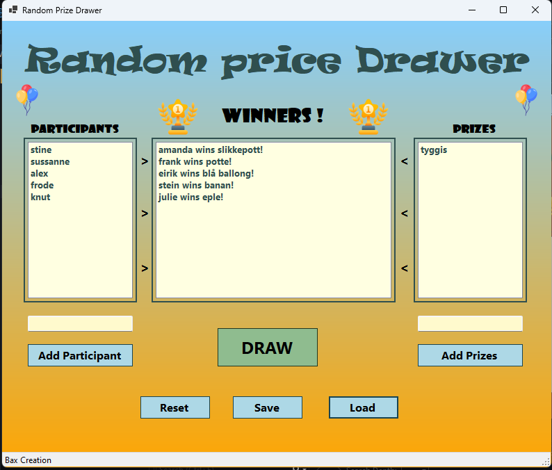

# Random Prize Drawer

A simple Windows Forms application that randomly pairs participants with prizes.
The app is designed for events, parties, or any occasion where you need to randomly,
assign prizes to participants in a visually appealing and interactive way!

---

## Features

- **Add Participants**: Input names into the participant list.
- **Add Prizes**: Input prizes into the prize list.
- **Random Draw**: Randomly pair participants with prizes.
- **Save and Load**: Save the session state (participants, prizes, winners) and load it later.
- **Reset**: Clear all data to start fresh.
- **Gradient Background**: gradient UI for a modern and vibrant look.
- **Custom Borders**: Borders around sections for better organization and aesthetics.
- **Drag and Drop**: You can drag and drop `.txt` files directly into the lists.

---

## Screenshot

---

## How It Works

1. **Add Participants**: Enter participant names in the "Add Participant" field and click the `Add Participant` button.
2. **Add Prizes**: Enter prize names in the "Add Prizes" field and click the `Add Prizes` button.
3. **Draw Winners**:
   - Click the `DRAW` button to randomly pair participants and prizes.
   - The selected participant and prize are displayed in the "Winners" list, and they are removed from the respective lists.
4. **Save and Load**:
   - Click `Save` to save the current session.
   - Click `Load` to restore a previously saved session.
5. **Reset**: Click `Reset` to clear all lists and start anew.

---

## Installation

1. **Clone the repository:**
	- **https://github.com/bax082024/RandomPrizeDrawer.git**
2. Open the project in **Visual Studio**.
3. **Rebuild** and run the project.

---

